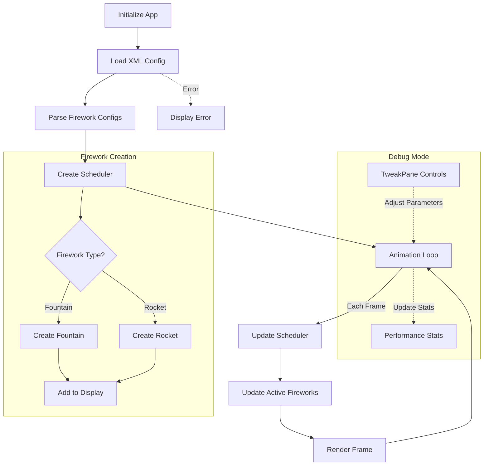

# Fireworks Application Workflow

This document outlines the core workflow of the Fireworks application, showing how data flows through the system from XML configuration to rendered display.

## Application Flow

The application follows these key steps:

1. **Initialization**: Setup PIXI.js application and load resources
2. **XML Loading**: Parse fireworks configuration from XML file
3. **Scheduler Creation**: Initialize scheduler with firework configurations
4. **Animation Loop**: Update and render fireworks based on elapsed time
5. **Debug Mode**: Optional debug controls and statistics (when enabled)

## Workflow Diagram

## Key Components

- **XML Loader**: Parses fireworks.xml to extract configuration data
- **Scheduler**: Manages timing of firework creation and lifecycle
- **Firework Types**:
  - **Fountain**: Emits particles from a fixed position
  - **Rocket**: Travels along a path before exploding
- **Particle System**: Manages particle creation, updates, and pooling
- **Debug Tools**: Performance monitoring and parameter adjustment

## Debug Mode

Debug mode can be enabled by adding `?mode=debug` to the URL. This provides:
- Real-time parameter adjustments via TweakPane
- Performance statistics (FPS, memory usage)
- Particle count monitoring
- Particle pooling toggle

## Responsive Design

The application automatically scales to fit the browser window while maintaining the logical coordinate system defined in the XML (1024×768 with origin at center).