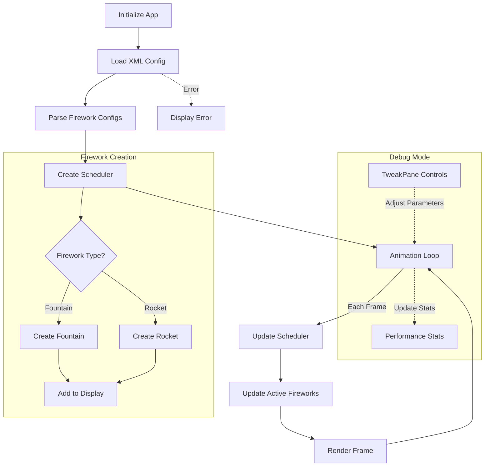

# Fireworks Application Workflow

## Application Flow

The application follows these key steps:

1. **Initialization**: Setup PIXI.js application and load resources
2. **XML Loading**: Parse fireworks configuration from XML file
3. **Scheduler Creation**: Initialize scheduler with firework configurations
4. **Animation Loop**: Update and render fireworks based on elapsed time
5. **Debug Mode**: Optional debug controls and statistics (when enabled)

## Workflow Diagram

## Additional Configuration

For detailed information about:
- Debug Mode features (`?mode=debug`)
- Alternative Mode settings (`?mode=alt`)
- XML configuration options
- Runtime settings and parameters

Please refer to the README.md file, which contains comprehensive documentation on these topics.

